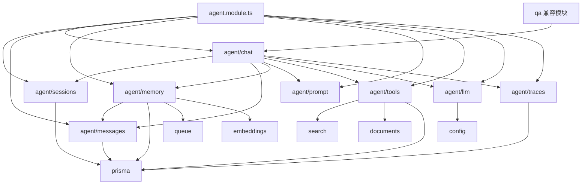
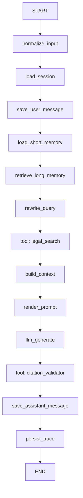

# Agent 模块架构设计方案

日期：2026-06-30

## 1. 目标

将当前较轻量的 `apps/backend/src/modules/agents` 重构为结构清晰的 `agent` 领域模块，支撑法律问答、多轮法律聊天、工具调用、短期记忆、长期记忆、模型注册，以及可追踪的 LangGraph 工作流。

当前项目已经具备几个关键基础：

- `SearchService`：基于 PostgreSQL/pgvector 的法律知识库混合检索。
- `DeepSeekLlmService`：OpenAI-compatible 的 DeepSeek 聊天模型调用。
- `LegalQaGraphService`：基于 LangGraph 的单轮法律 QA 编排。

新设计应当保留当前 QA 能力，同时为会话式 Agent 做好扩展。

## 2. 设计原则

- NestJS 模块保持 feature-oriented，不按纯技术层堆叠。
- `agent/chat` 作为编排入口，避免继续膨胀成巨型 service。
- `agent/llm` 保持模型供应商无关，DeepSeek 只是一个 provider。
- Prompt 不写死在模型客户端里。
- Tool 作为可注册、可校验、可追踪的能力。
- 会话数据放到 `sessions` 和 `messages`。
- 短期记忆和长期记忆分开设计。
- LangGraph JS 用于状态图编排、持久化、流式输出、中断恢复和长任务。
- LangChain JS 用于模型集成、消息结构、工具 schema 和结构化输出等基础能力。

## 3. 推荐目录规范

```txt
apps/backend/src/modules/agent/
  agent.module.ts

  prompt/
    prompt.module.ts
    prompt-registry.service.ts
    prompt-renderer.service.ts
    contracts/
      prompt-template.interface.ts
    templates/
      legal-qa.prompt.ts
      legal-chat.prompt.ts
      citation-check.prompt.ts
      query-rewrite.prompt.ts

  tools/
    tools.module.ts
    tool-registry.service.ts
    tool-executor.service.ts
    contracts/
      agent-tool.interface.ts
      tool-result.interface.ts
    builtin/
      legal-search.tool.ts
      document-reader.tool.ts
      citation-validator.tool.ts
      query-rewrite.tool.ts

  memory/
    memory.module.ts
    memory.service.ts
    short-term-memory.service.ts
    long-term-memory.service.ts
    memory-retrieval.service.ts
    memory-summarizer.processor.ts
    dto/

  llm/
    llm.module.ts
    llm-registry.service.ts
    llm-router.service.ts
    contracts/
      llm-client.interface.ts
      llm-message.interface.ts
    providers/
      deepseek.client.ts
      mock.client.ts

  sessions/
    sessions.module.ts
    sessions.controller.ts
    sessions.service.ts
    dto/

  messages/
    messages.module.ts
    messages.controller.ts
    messages.service.ts
    message-mapper.service.ts
    dto/

  chat/
    chat.module.ts
    chat.controller.ts
    chat.service.ts
    graphs/
      legal-chat.graph.ts
      legal-qa.graph.ts
    dto/

  traces/
    traces.module.ts
    agent-traces.service.ts
```

推荐迁移路径：

```txt
apps/backend/src/modules/agents/deepseek-llm.service.ts
  -> apps/backend/src/modules/agent/llm/providers/deepseek.client.ts

apps/backend/src/modules/agents/legal-qa-graph.service.ts
  -> apps/backend/src/modules/agent/chat/graphs/legal-qa.graph.ts
```

当前 `qa` 模块先作为兼容 API 保留：

```txt
qa.controller.ts
  -> qa.service.ts
    -> agent/chat/chat.service.ts
      -> legal-qa.graph.ts
```

## 4. 模块职责

### 4.1 `agent/prompt`

负责系统提示词、任务提示词、提示词版本和变量渲染。

职责：

- 按名称和版本注册 prompt 模板。
- 根据运行时变量渲染 prompt。
- 将法律领域指令从 LLM provider 中剥离。
- 为后续 prompt 评测和回滚留接口。

建议模板：

| 模板 | 用途 |
|---|---|
| `legal-qa` | 单轮法律问答，要求引用来源 |
| `legal-chat` | 多轮法律咨询 |
| `citation-check` | 检查回答引用覆盖情况 |
| `query-rewrite` | 将用户问题改写为检索 query |

示例 API：

```ts
PromptRegistryService.get('legal-qa', { version: 'v1' });
PromptRendererService.render(template, variables);
```

### 4.2 `agent/tools`

负责工具注册、参数校验、执行、超时控制和 trace 快照。

职责：

- 注册内置法律 RAG 工具。
- 将现有 backend service 包装成 agent tool。
- 使用 `zod` 之类的 schema 校验工具输入。
- 工具名使用 `snake_case`，提升不同模型 provider 的兼容性。
- 内部错误和密钥不得暴露给 LLM 可见的工具输出。

建议内置工具：

| Tool | 背后服务 | 用途 |
|---|---|---|
| `legal_search` | `SearchService` | 法律知识库向量/关键词混合检索 |
| `document_reader` | documents/files 模块 | 读取指定文档或 chunk 原文 |
| `citation_validator` | 本地校验器 | 校验 `[1]` 这类引用是否对应真实来源 |
| `query_rewrite` | LLM 或本地规则 | 将用户问题改写为适合检索的 query |

建议接口：

```ts
export interface AgentTool<TInput = unknown, TOutput = unknown> {
  name: string;
  description: string;
  schema: unknown;
  execute(input: TInput, context: AgentRunContext): Promise<TOutput>;
}
```

### 4.3 `agent/memory`

负责短期记忆和长期记忆。

短期记忆：

- 当前 thread/session 的上下文。
- 最近 N 条消息。
- 可选的会话摘要。
- 可通过 LangGraph `thread_id` 传递，也可从 `AgentMessage` 读取。

长期记忆：

- 用户偏好。
- 稳定事实。
- 案件背景。
- 长周期法律咨询事实。
- 可使用当前 Qwen embedding 维度 `vector(1024)` 做语义召回。

推荐落地：

- 第一阶段：直接从 `AgentMessage` 读取最近消息作为短期记忆。
- 第二阶段：用 BullMQ 对长会话做摘要，写入 `AgentMemory(type = short_summary)`。
- 第三阶段：对 `AgentMemory.embedding` 做 pgvector 语义检索，形成长期记忆召回。

### 4.4 `agent/llm`

负责模型注册和统一调用。

职责：

- 注册可用 LLM provider。
- 根据配置选择默认模型。
- 隔离 provider-specific 参数，不让 graph 层感知。
- 先支持非流式生成，后续再加 streaming。
- 提供 mock client，方便单元测试。

建议接口：

```ts
export interface LlmClient {
  provider: string;
  model: string;
  enabled(): boolean;
  invoke(input: LlmInvokeInput): Promise<LlmInvokeResult>;
  stream?(input: LlmInvokeInput): AsyncIterable<LlmStreamChunk>;
}
```

初始 provider：

```txt
deepseek.client.ts
mock.client.ts
```

后续可扩展：

- 本地 vLLM OpenAI-compatible endpoint
- Qwen chat model
- 其他 OpenAI-compatible 商业模型

### 4.5 `agent/sessions`

负责会话生命周期。

职责：

- 创建会话。
- 查询会话列表。
- 归档会话。
- 更新标题和知识库范围。
- 会话 metadata 与消息内容分离。

建议接口：

```txt
POST   /api/agent/sessions
GET    /api/agent/sessions
GET    /api/agent/sessions/:id
PATCH  /api/agent/sessions/:id
DELETE /api/agent/sessions/:id
```

### 4.6 `agent/messages`

负责消息持久化，不负责生成回答。

职责：

- 持久化 user、assistant、tool、system 消息。
- 保存 citations、tool calls、metadata 快照。
- 为 chat 和 memory 模块提供历史消息。
- 将消息存储与回答生成解耦。

建议接口：

```txt
GET /api/agent/sessions/:sessionId/messages
```

### 4.7 `agent/chat`

负责聊天交互入口和 graph 编排。

职责：

- 接收聊天请求。
- 创建或读取 session。
- 写入用户消息。
- 加载记忆。
- 执行 LangGraph 工作流。
- 写入 assistant 消息。
- 返回 answer、citations、source chunks 和 trace id。

建议接口：

```txt
POST /api/agent/chat
```

建议请求结构：

```ts
export interface AgentChatRequest {
  agentType?: 'legal_qa' | 'legal_research' | 'document_review';
  knowledgeBaseIds?: string[];
  message: string;
  sessionId?: string;
  stream?: boolean;
  topK?: number;
}
```

建议响应结构：

```ts
export interface AgentChatResponse {
  answer: string;
  citations: QaCitation[];
  fallbackUsed?: boolean;
  messageId: string;
  modelInfo?: {
    model: string;
    provider: string;
  };
  sessionId: string;
  sourceChunks: SearchResult[];
  traceId?: string;
}
```

## 5. 模块依赖关系图



依赖规则：

- `search`、`documents`、`embeddings`、`prisma`、`queue` 不反向依赖 `agent`。
- `qa` 可以依赖 `agent/chat`，作为旧接口兼容层。
- `agent/llm` 不依赖 `agent/chat`。
- `agent/prompt` 不调用模型，也不调用工具。
- `agent/tools` 可以调用业务 service，但不决定 graph 流程。

## 6. 结合 LangChain JS 和 LangGraph JS 的官方推荐

官方文档中的设计思想与本方案对应关系如下：

- LangChain JS 将 Agent 描述为 model 在 harness 中循环调用 tools，直到任务完成。Harness 包含 model、prompt、tools，以及塑造行为的 middleware。
- LangChain JS 的 Tool 是带明确输入输出的 callable function，工具名推荐保持 provider-friendly，例如使用 `snake_case`。
- LangGraph JS 更偏底层编排运行时，适合构建长时间运行、具备状态的 Agent。
- LangGraph JS 推荐先将流程拆成离散节点，再通过边连接，并用显式 graph state 共享上下文。
- LangGraph JS 的持久化区分 checkpointer 和 store：
  - checkpointer 保存单个 thread 的 graph state，适合短期记忆。
  - store 保存跨 thread 的应用数据，适合长期记忆。
- 生产环境应使用数据库支撑的 checkpointer，不建议依赖内存持久化。

在本项目中的推荐映射：

| 关注点 | 项目模块 | LangChain/LangGraph 能力 |
|---|---|---|
| Prompt 模板 | `agent/prompt` | system prompt / dynamic prompt |
| 模型调用 | `agent/llm` | LangChain chat model integrations |
| 工具调用 | `agent/tools` | 带 schema 的 LangChain tools |
| 工作流编排 | `agent/chat/graphs` | LangGraph `StateGraph` |
| 短期记忆 | `agent/memory` + graph checkpointer | LangGraph checkpointer + `thread_id` |
| 长期记忆 | `AgentMemory` + pgvector | LangGraph store 概念，由业务数据库承载 |
| 可观测性 | `agent/traces` | 本地 trace 表，后续可接 LangSmith |

推荐法律聊天 graph：



建议 LangGraph state：

```ts
interface LegalChatState {
  answer?: string;
  citations: QaCitation[];
  fallbackUsed: boolean;
  knowledgeBaseIds?: string[];
  longTermMemory: AgentMemorySnapshot[];
  messages: AgentRuntimeMessage[];
  normalizedQuery?: string;
  prompt?: string;
  question: string;
  retrievalError?: string;
  searchResults: SearchResult[];
  sessionId: string;
  topK: number;
  traceId?: string;
  userId?: string;
}
```

实践建议：

- Graph state 保持原始数据，prompt 格式化放到 `render_prompt` 节点。
- 每个 graph node 只做一个离散步骤。
- 只有确实存在动态路由时，才使用 conditional edge。
- 检索、校验、读取文档等能力通过 tool node 表达。
- 添加 LangGraph checkpointer 时使用 `thread_id = sessionId`。
- 即使使用 LangGraph checkpointer，Prisma 的 `AgentMessage` 仍作为产品侧会话历史的事实来源。

## 7. Prisma 数据模型设计

下面是建议 schema。第一阶段刻意将 `userId` 设计为 scalar UUID，不强制改动当前 RBAC `User` 模型关系，降低迁移风险。

```prisma
model AgentSession {
  id               String               @id @default(uuid()) @db.Uuid
  userId           String?              @map("user_id") @db.Uuid
  title            String?
  agentType        AgentType            @default(legal_qa) @map("agent_type")
  status           AgentSessionStatus   @default(active)
  knowledgeBaseIds String[]             @default([]) @map("knowledge_base_ids")
  metadata         Json                 @default("{}")
  messages         AgentMessage[]
  createdAt        DateTime             @default(now()) @map("created_at")
  updatedAt        DateTime             @updatedAt @map("updated_at")

  @@index([userId])
  @@index([agentType])
  @@index([status])
  @@map("agent_sessions")
}

model AgentMessage {
  id        String             @id @default(uuid()) @db.Uuid
  sessionId String             @map("session_id") @db.Uuid
  session   AgentSession       @relation(fields: [sessionId], references: [id], onDelete: Cascade)
  role      AgentMessageRole
  content   String
  status    AgentMessageStatus @default(completed)
  citations Json               @default("[]")
  toolCalls Json               @default("[]") @map("tool_calls")
  metadata  Json               @default("{}")
  createdAt DateTime           @default(now()) @map("created_at")

  @@index([sessionId])
  @@index([role])
  @@index([status])
  @@map("agent_messages")
}

model AgentMemory {
  id        String          @id @default(uuid()) @db.Uuid
  userId    String?         @map("user_id") @db.Uuid
  sessionId String?         @map("session_id") @db.Uuid
  type      AgentMemoryType
  content   String
  summary   String?
  embedding Unsupported("vector(1024)")?
  metadata  Json            @default("{}")
  createdAt DateTime        @default(now()) @map("created_at")
  updatedAt DateTime        @updatedAt @map("updated_at")

  @@index([userId])
  @@index([sessionId])
  @@index([type])
  @@map("agent_memories")
}

model AgentTrace {
  id             String   @id @default(uuid()) @db.Uuid
  sessionId      String?  @map("session_id") @db.Uuid
  messageId      String?  @map("message_id") @db.Uuid
  agentType      String   @map("agent_type")
  input          Json     @default("{}")
  output         Json     @default("{}")
  toolCalls      Json     @default("[]") @map("tool_calls")
  promptSnapshot Json     @default("{}") @map("prompt_snapshot")
  modelInfo      Json     @default("{}") @map("model_info")
  error          String?
  latencyMs      Int?     @map("latency_ms")
  createdAt      DateTime @default(now()) @map("created_at")

  @@index([sessionId])
  @@index([messageId])
  @@index([agentType])
  @@map("agent_traces")
}

enum AgentType {
  legal_qa
  legal_research
  document_review
}

enum AgentSessionStatus {
  active
  archived
}

enum AgentMessageRole {
  system
  user
  assistant
  tool
}

enum AgentMessageStatus {
  pending
  running
  completed
  failed
}

enum AgentMemoryType {
  short_summary
  long_term_fact
  user_preference
  case_context
}
```

后续索引建议：

```sql
CREATE INDEX IF NOT EXISTS agent_memories_embedding_idx
ON agent_memories
USING ivfflat (embedding vector_cosine_ops)
WITH (lists = 100);
```

Embedding 维度沿用当前 Qwen embedding 服务：`vector(1024)`。

## 8. API 设计

初始接口：

```txt
POST   /api/agent/chat
POST   /api/agent/sessions
GET    /api/agent/sessions
GET    /api/agent/sessions/:id
PATCH  /api/agent/sessions/:id
DELETE /api/agent/sessions/:id
GET    /api/agent/sessions/:sessionId/messages
```

兼容接口：

```txt
POST /api/qa/ask
```

内部调用：

```txt
POST /api/qa/ask
  -> QaService.ask()
    -> AgentChatService.askOnce()
```

## 9. 分阶段落地计划

### 第一阶段：抽出 LLM 和 Prompt

- 新建 `agent/llm`。
- 将 DeepSeek 逻辑移动到 `providers/deepseek.client.ts`。
- 新建 `LlmRegistryService`。
- 新建 `agent/prompt`。
- 将硬编码法律系统提示词移动到 `templates/legal-qa.prompt.ts`。
- 保持 `/api/qa/ask` 行为不变。

### 第二阶段：抽出 Tools

- 新建 `agent/tools`。
- 将 `SearchService.search()` 包装为 `legal_search`。
- 新建 `citation_validator`。
- 增加 tool execution trace 快照。

### 第三阶段：增加 Sessions、Messages 和 Chat API

- 增加 Prisma models 和 migration。
- 新建 `sessions`、`messages`、`chat` 模块。
- 新增 `/api/agent/chat`。
- 将 `/api/qa/ask` 改为调用 `AgentChatService.askOnce()`。

### 第四阶段：增加 Memory

- 先用最近的 `AgentMessage` 作为短期记忆。
- 使用 BullMQ 对长会话做摘要。
- 将摘要写入 `AgentMemory`。
- 使用 pgvector 增加长期记忆语义检索。

### 第五阶段：增加 Streaming 和 Checkpointing

- 增加 streaming 接口或 SSE 响应。
- 使用数据库 backed checkpointer 编译 LangGraph。
- 使用 `thread_id = sessionId`。
- Prisma `AgentMessage` 保持为产品侧会话历史。

## 10. 官方参考

- LangGraph JS overview: https://docs.langchain.com/oss/javascript/langgraph/overview
- LangGraph JS thinking guide: https://docs.langchain.com/oss/javascript/langgraph/thinking-in-langgraph
- LangGraph JS persistence: https://docs.langchain.com/oss/javascript/langgraph/persistence
- LangGraph JS memory: https://docs.langchain.com/oss/javascript/langgraph/add-memory
- LangChain JS agents: https://docs.langchain.com/oss/javascript/langchain/agents
- LangChain JS tools: https://docs.langchain.com/oss/javascript/langchain/tools
