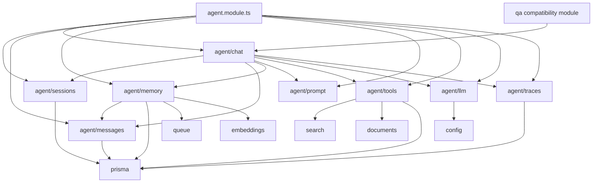
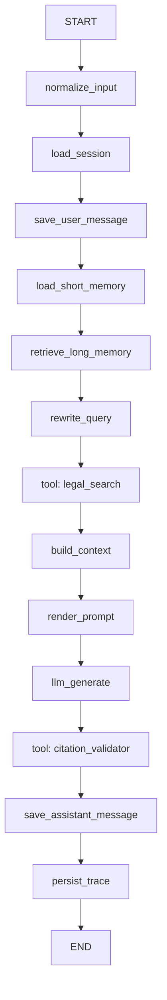

# Agent Module Architecture Plan

Date: 2026-06-30

## 1. Goal

Refactor the current lightweight `apps/backend/src/modules/agents` implementation into a structured `agent` domain that can support legal QA, multi-turn legal chat, tool calling, short-term memory, long-term memory, model registration, and traceable LangGraph workflows.

The current code has three important building blocks already:

- `SearchService`: hybrid legal knowledge retrieval over PostgreSQL/pgvector.
- `DeepSeekLlmService`: OpenAI-compatible DeepSeek chat model invocation.
- `LegalQaGraphService`: LangGraph-based one-shot legal QA orchestration.

The new design should preserve the current QA behavior while preparing the backend for session-based agents.

## 2. Design Principles

- Keep NestJS modules feature-oriented and injectable.
- Keep `agent/chat` as the orchestration entry, not a large god service.
- Keep `agent/llm` provider-neutral. DeepSeek is one provider, not the abstraction.
- Keep prompts outside model clients.
- Keep tools as registered, schema-validated capabilities.
- Keep conversation data in `sessions` and `messages`.
- Keep short-term memory and long-term memory separate.
- Use LangGraph JS for stateful orchestration, persistence, streaming, interrupts, and graph evolution.
- Use LangChain JS for model integrations, messages, tools, schemas, and structured output helpers.

## 3. Recommended Directory Convention

```txt
apps/backend/src/modules/agent/
  agent.module.ts

  prompt/
    prompt.module.ts
    prompt-registry.service.ts
    prompt-renderer.service.ts
    contracts/
      prompt-template.interface.ts
    templates/
      legal-qa.prompt.ts
      legal-chat.prompt.ts
      citation-check.prompt.ts
      query-rewrite.prompt.ts

  tools/
    tools.module.ts
    tool-registry.service.ts
    tool-executor.service.ts
    contracts/
      agent-tool.interface.ts
      tool-result.interface.ts
    builtin/
      legal-search.tool.ts
      document-reader.tool.ts
      citation-validator.tool.ts
      query-rewrite.tool.ts

  memory/
    memory.module.ts
    memory.service.ts
    short-term-memory.service.ts
    long-term-memory.service.ts
    memory-retrieval.service.ts
    memory-summarizer.processor.ts
    dto/

  llm/
    llm.module.ts
    llm-registry.service.ts
    llm-router.service.ts
    contracts/
      llm-client.interface.ts
      llm-message.interface.ts
    providers/
      deepseek.client.ts
      mock.client.ts

  sessions/
    sessions.module.ts
    sessions.controller.ts
    sessions.service.ts
    dto/

  messages/
    messages.module.ts
    messages.controller.ts
    messages.service.ts
    message-mapper.service.ts
    dto/

  chat/
    chat.module.ts
    chat.controller.ts
    chat.service.ts
    graphs/
      legal-chat.graph.ts
      legal-qa.graph.ts
    dto/

  traces/
    traces.module.ts
    agent-traces.service.ts
```

Recommended migration path:

```txt
apps/backend/src/modules/agents/deepseek-llm.service.ts
  -> apps/backend/src/modules/agent/llm/providers/deepseek.client.ts

apps/backend/src/modules/agents/legal-qa-graph.service.ts
  -> apps/backend/src/modules/agent/chat/graphs/legal-qa.graph.ts
```

Keep the current `qa` module as a compatibility API at first:

```txt
qa.controller.ts
  -> qa.service.ts
    -> agent/chat/chat.service.ts
      -> legal-qa.graph.ts
```

## 4. Module Responsibilities

### 4.1 `agent/prompt`

Owns system prompts, task prompts, prompt versions, and rendering.

Responsibilities:

- Register prompt templates by name and version.
- Render templates using runtime variables.
- Keep legal domain instructions out of LLM provider clients.
- Support later prompt evaluation and rollback.

Suggested templates:

| Template | Purpose |
|---|---|
| `legal-qa` | One-shot legal QA with citations |
| `legal-chat` | Multi-turn legal consultation |
| `citation-check` | Validate answer citation coverage |
| `query-rewrite` | Rewrite user question for retrieval |

Example service API:

```ts
PromptRegistryService.get('legal-qa', { version: 'v1' });
PromptRendererService.render(template, variables);
```

### 4.2 `agent/tools`

Owns tool registration, validation, execution, timeout control, and trace snapshots.

Responsibilities:

- Register built-in legal RAG tools.
- Wrap existing backend services as agent tools.
- Validate input schemas, preferably with `zod`.
- Use `snake_case` tool names for provider compatibility.
- Never leak internal errors or secrets into LLM-visible tool output.

Recommended built-in tools:

| Tool | Backing service | Purpose |
|---|---|---|
| `legal_search` | `SearchService` | Hybrid vector/keyword legal knowledge retrieval |
| `document_reader` | documents/files modules | Read selected document/chunk text |
| `citation_validator` | local validator | Check `[1]` style citations against retrieved sources |
| `query_rewrite` | LLM or local rules | Convert user question into retrieval-friendly query |

Suggested interface:

```ts
export interface AgentTool<TInput = unknown, TOutput = unknown> {
  name: string;
  description: string;
  schema: unknown;
  execute(input: TInput, context: AgentRunContext): Promise<TOutput>;
}
```

### 4.3 `agent/memory`

Owns both short-term and long-term memory.

Short-term memory:

- Current thread/session context.
- Last N messages.
- Optional summarized session context.
- Should be passed to LangGraph by `thread_id` or loaded from `AgentMessage`.

Long-term memory:

- User preferences.
- Stable user facts.
- Case background.
- Long-lived legal consultation facts.
- Optional vector embedding using existing Qwen embedding dimension `vector(1024)`.

Recommended approach:

- Phase 1: Use `AgentMessage` as short-term memory source.
- Phase 2: Summarize long sessions with BullMQ into `AgentMemory(type = short_summary)`.
- Phase 3: Add semantic retrieval over `AgentMemory.embedding` for long-term memory.

### 4.4 `agent/llm`

Owns model registration and model invocation.

Responsibilities:

- Register all available LLM providers.
- Pick default model by config.
- Support provider-specific options without leaking them to graph code.
- Support sync generation first; add streaming later.
- Provide a mock client for unit tests.

Suggested interface:

```ts
export interface LlmClient {
  provider: string;
  model: string;
  enabled(): boolean;
  invoke(input: LlmInvokeInput): Promise<LlmInvokeResult>;
  stream?(input: LlmInvokeInput): AsyncIterable<LlmStreamChunk>;
}
```

Initial providers:

```txt
deepseek.client.ts
mock.client.ts
```

Future providers:

- local vLLM OpenAI-compatible endpoint
- Qwen chat model
- OpenAI-compatible commercial models

### 4.5 `agent/sessions`

Owns conversation session lifecycle.

Responsibilities:

- Create sessions.
- List sessions.
- Archive sessions.
- Update title and knowledge-base scope.
- Keep session metadata separate from messages.

Suggested endpoints:

```txt
POST   /api/agent/sessions
GET    /api/agent/sessions
GET    /api/agent/sessions/:id
PATCH  /api/agent/sessions/:id
DELETE /api/agent/sessions/:id
```

### 4.6 `agent/messages`

Owns persisted message records.

Responsibilities:

- Persist user, assistant, tool, and system messages.
- Store citations, tool calls, and metadata snapshots.
- Provide message history to chat and memory modules.
- Keep message persistence separate from answer generation.

Suggested endpoint:

```txt
GET /api/agent/sessions/:sessionId/messages
```

### 4.7 `agent/chat`

Owns chat interaction and graph orchestration.

Responsibilities:

- Accept chat requests.
- Create or load sessions.
- Save user messages.
- Load memory.
- Execute LangGraph workflow.
- Save assistant messages.
- Return answer, citations, source chunks, and trace id.

Suggested endpoint:

```txt
POST /api/agent/chat
```

Suggested request:

```ts
export interface AgentChatRequest {
  agentType?: 'legal_qa' | 'legal_research' | 'document_review';
  knowledgeBaseIds?: string[];
  message: string;
  sessionId?: string;
  stream?: boolean;
  topK?: number;
}
```

Suggested response:

```ts
export interface AgentChatResponse {
  answer: string;
  citations: QaCitation[];
  fallbackUsed?: boolean;
  messageId: string;
  modelInfo?: {
    model: string;
    provider: string;
  };
  sessionId: string;
  sourceChunks: SearchResult[];
  traceId?: string;
}
```

## 5. Module Dependency Diagram



Rules:

- `search`, `documents`, `embeddings`, `prisma`, and `queue` must not import `agent`.
- `qa` may import `agent/chat` as a compatibility facade.
- `agent/llm` must not import `agent/chat`.
- `agent/prompt` must not call models or tools.
- `agent/tools` may call business services but should not decide the graph flow.

## 6. LangChain JS and LangGraph JS Alignment

Official LangChain/LangGraph guidance maps cleanly to this design:

- LangChain JS describes an agent as a model calling tools inside a harness. The harness includes model, prompt, tools, and behavior-shaping middleware.
- LangChain JS tools are callable functions with well-defined inputs and outputs. Tool names should stay provider-friendly, for example `snake_case`.
- LangGraph JS is positioned as a low-level orchestration runtime for long-running, stateful agents.
- LangGraph JS recommends decomposing a workflow into discrete nodes, connecting nodes with edges, and sharing explicit graph state.
- LangGraph JS persistence separates checkpointers and stores:
  - Checkpointers persist graph state per thread and are suitable for short-term memory.
  - Stores persist application-defined data across threads and are suitable for long-term memory.
- LangGraph JS production guidance recommends database-backed checkpointers instead of in-memory persistence.

Recommended usage in this project:

| Concern | Project module | LangChain/LangGraph feature |
|---|---|---|
| Prompt templates | `agent/prompt` | system prompt / dynamic prompt |
| Model calls | `agent/llm` | LangChain chat model integrations |
| Tool calling | `agent/tools` | LangChain tools with schemas |
| Workflow | `agent/chat/graphs` | LangGraph `StateGraph` |
| Short-term memory | `agent/memory` + graph checkpointer | LangGraph checkpointer with `thread_id` |
| Long-term memory | `AgentMemory` + pgvector | LangGraph store concept, backed by app database |
| Observability | `agent/traces` | local trace table; optional LangSmith later |

Recommended graph shape for legal chat:



Suggested LangGraph state:

```ts
interface LegalChatState {
  answer?: string;
  citations: QaCitation[];
  fallbackUsed: boolean;
  knowledgeBaseIds?: string[];
  longTermMemory: AgentMemorySnapshot[];
  messages: AgentRuntimeMessage[];
  normalizedQuery?: string;
  prompt?: string;
  question: string;
  retrievalError?: string;
  searchResults: SearchResult[];
  sessionId: string;
  topK: number;
  traceId?: string;
  userId?: string;
}
```

Guidance:

- Keep graph state raw. Format final prompts inside `render_prompt`.
- Use graph nodes for discrete steps.
- Use conditional edges for routing only when the route is truly dynamic.
- Use tool nodes for side-effect-aware retrieval/action steps.
- Use `thread_id = sessionId` when adding LangGraph checkpointers.
- Keep Prisma records as the source of product history, even if a LangGraph checkpointer is also used.

## 7. Prisma Data Model Design

The following schema is a proposal. It intentionally stores `userId` as a scalar UUID to avoid forcing a relation change on the current RBAC `User` model during the first migration.

```prisma
model AgentSession {
  id               String               @id @default(uuid()) @db.Uuid
  userId           String?              @map("user_id") @db.Uuid
  title            String?
  agentType        AgentType            @default(legal_qa) @map("agent_type")
  status           AgentSessionStatus   @default(active)
  knowledgeBaseIds String[]             @default([]) @map("knowledge_base_ids")
  metadata         Json                 @default("{}")
  messages         AgentMessage[]
  createdAt        DateTime             @default(now()) @map("created_at")
  updatedAt        DateTime             @updatedAt @map("updated_at")

  @@index([userId])
  @@index([agentType])
  @@index([status])
  @@map("agent_sessions")
}

model AgentMessage {
  id        String             @id @default(uuid()) @db.Uuid
  sessionId String             @map("session_id") @db.Uuid
  session   AgentSession       @relation(fields: [sessionId], references: [id], onDelete: Cascade)
  role      AgentMessageRole
  content   String
  status    AgentMessageStatus @default(completed)
  citations Json               @default("[]")
  toolCalls Json               @default("[]") @map("tool_calls")
  metadata  Json               @default("{}")
  createdAt DateTime           @default(now()) @map("created_at")

  @@index([sessionId])
  @@index([role])
  @@index([status])
  @@map("agent_messages")
}

model AgentMemory {
  id        String          @id @default(uuid()) @db.Uuid
  userId    String?         @map("user_id") @db.Uuid
  sessionId String?         @map("session_id") @db.Uuid
  type      AgentMemoryType
  content   String
  summary   String?
  embedding Unsupported("vector(1024)")?
  metadata  Json            @default("{}")
  createdAt DateTime        @default(now()) @map("created_at")
  updatedAt DateTime        @updatedAt @map("updated_at")

  @@index([userId])
  @@index([sessionId])
  @@index([type])
  @@map("agent_memories")
}

model AgentTrace {
  id             String   @id @default(uuid()) @db.Uuid
  sessionId      String?  @map("session_id") @db.Uuid
  messageId      String?  @map("message_id") @db.Uuid
  agentType      String   @map("agent_type")
  input          Json     @default("{}")
  output         Json     @default("{}")
  toolCalls      Json     @default("[]") @map("tool_calls")
  promptSnapshot Json     @default("{}") @map("prompt_snapshot")
  modelInfo      Json     @default("{}") @map("model_info")
  error          String?
  latencyMs      Int?     @map("latency_ms")
  createdAt      DateTime @default(now()) @map("created_at")

  @@index([sessionId])
  @@index([messageId])
  @@index([agentType])
  @@map("agent_traces")
}

enum AgentType {
  legal_qa
  legal_research
  document_review
}

enum AgentSessionStatus {
  active
  archived
}

enum AgentMessageRole {
  system
  user
  assistant
  tool
}

enum AgentMessageStatus {
  pending
  running
  completed
  failed
}

enum AgentMemoryType {
  short_summary
  long_term_fact
  user_preference
  case_context
}
```

Indexing follow-up:

```sql
CREATE INDEX IF NOT EXISTS agent_memories_embedding_idx
ON agent_memories
USING ivfflat (embedding vector_cosine_ops)
WITH (lists = 100);
```

Use the same embedding dimension as the current Qwen embedding service: `vector(1024)`.

## 8. API Surface

Initial APIs:

```txt
POST   /api/agent/chat
POST   /api/agent/sessions
GET    /api/agent/sessions
GET    /api/agent/sessions/:id
PATCH  /api/agent/sessions/:id
DELETE /api/agent/sessions/:id
GET    /api/agent/sessions/:sessionId/messages
```

Compatibility:

```txt
POST /api/qa/ask
```

Implementation:

```txt
POST /api/qa/ask
  -> QaService.ask()
    -> AgentChatService.askOnce()
```

## 9. Phased Implementation Plan

### Phase 1: Extract LLM and Prompt

- Create `agent/llm`.
- Move DeepSeek logic into `providers/deepseek.client.ts`.
- Create `LlmRegistryService`.
- Create `agent/prompt`.
- Move hardcoded legal system prompt into `templates/legal-qa.prompt.ts`.
- Keep `/api/qa/ask` behavior unchanged.

### Phase 2: Extract Tools

- Create `agent/tools`.
- Wrap `SearchService.search()` as `legal_search`.
- Create `citation_validator`.
- Add tool execution trace snapshots.

### Phase 3: Add Sessions, Messages, and Chat API

- Add Prisma models and migration.
- Add `sessions`, `messages`, and `chat` modules.
- Add `/api/agent/chat`.
- Make `/api/qa/ask` call `AgentChatService.askOnce()`.

### Phase 4: Add Memory

- Use recent `AgentMessage` records as short-term memory.
- Add BullMQ summarization job for long sessions.
- Store summaries in `AgentMemory`.
- Add semantic long-term memory retrieval with pgvector.

### Phase 5: Add Streaming and Checkpointing

- Add streaming endpoint or SSE response.
- Compile LangGraph with a database-backed checkpointer.
- Use `thread_id = sessionId`.
- Keep Prisma `AgentMessage` as product history.

## 10. Official References

- LangGraph JS overview: https://docs.langchain.com/oss/javascript/langgraph/overview
- LangGraph JS thinking guide: https://docs.langchain.com/oss/javascript/langgraph/thinking-in-langgraph
- LangGraph JS persistence: https://docs.langchain.com/oss/javascript/langgraph/persistence
- LangGraph JS memory: https://docs.langchain.com/oss/javascript/langgraph/add-memory
- LangChain JS agents: https://docs.langchain.com/oss/javascript/langchain/agents
- LangChain JS tools: https://docs.langchain.com/oss/javascript/langchain/tools
